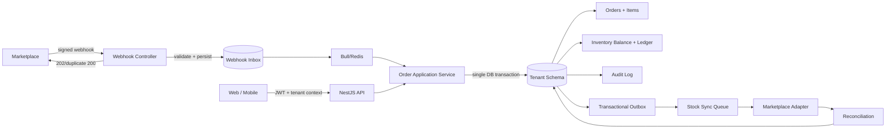

# Kế hoạch triển khai Production Pilot

## 1. Mục tiêu và giới hạn cam kết

Mục tiêu của kế hoạch là đưa hệ thống từ prototype có nghiệp vụ lõi thành một baseline đủ an toàn để chạy pilot với một cửa hàng và một marketplace thật. Kết quả phải ưu tiên tính đúng của đơn hàng và tồn kho, cô lập tenant, khả năng phục hồi khi dependency lỗi, và khả năng rollback.

Không có kế hoạch kỹ thuật nào có thể bảo đảm tuyệt đối ứng dụng “không bao giờ crash”. Cách tiếp cận thực tế là làm cho lỗi:

1. Ít xảy ra nhờ validation, type safety, transaction và constraint.
2. Không lan rộng nhờ isolation, queue, timeout và circuit boundary.
3. Có thể quan sát nhờ structured log, metrics, health check và audit.
4. Có thể phục hồi nhờ retry có giới hạn, idempotency, reconciliation và rollback.
5. Bị chặn trước production bằng build, test, security và migration gates.

### Success criteria cho pilot

- Backend, frontend và mobile đều có lệnh lint, type-check, test và build chạy xanh trong CI.
- Không thể tạo tồn kho âm hoặc `reserved_quantity > quantity` trong test đồng thời.
- Tạo đơn, item, reservation, audit và outbox cùng commit hoặc cùng rollback.
- Người dùng tenant A không thể đọc hoặc thay đổi tài nguyên của tenant B.
- Webhook sai chữ ký bị từ chối; delivery trùng không tạo đơn trùng.
- Mọi chuyển trạng thái đơn không hợp lệ bị từ chối mà không tạo side effect.
- Frontend có loading, empty, recoverable error và global error fallback cho luồng pilot.
- Deployment có readiness/liveness, backup đã kiểm tra restore, migration dry-run và rollback runbook.
- Một marketplace pilot xử lý được receive order, sync stock, retry và reconciliation bằng sandbox hoặc tài khoản thử nghiệm thật.

## 2. Giả định lập kế hoạch

- Nhóm thực hiện gồm khoảng hai full-stack engineer và QA bán thời gian.
- Thời gian mục tiêu là 8-10 tuần; estimate cần điều chỉnh sau khi chọn marketplace và có quyền truy cập sandbox.
- PostgreSQL, NestJS, TypeORM, Redis/Bull, Next.js và React Native tiếp tục được sử dụng.
- Frontend hiện dùng Next.js 16.1.5; kế hoạch không ép rewrite toàn bộ sang Server Components.
- Marketplace mặc định để estimate là Shopee do phù hợp bối cảnh, nhưng phải xác nhận trước Phase 3.
- Các thay đổi auth/refresh token và mobile đang nằm trong worktree hiện tại là công việc đang dở; implementation phải rebase kế hoạch lên trạng thái đó, không ghi đè.

## 3. Baseline đã quan sát trong repository

| Khu vực | Bằng chứng hiện tại | Rủi ro cần xử lý |
|---|---|---|
| Build frontend | `frontend/app/activity/page.tsx` import `Column`, nhưng `frontend/components/ui/Table.tsx` không export type này | Production bundle đang bị chặn |
| Test backend | Chỉ thấy `app.controller.spec.ts` và một e2e skeleton | Không có regression protection cho nghiệp vụ lõi |
| Test frontend | `frontend/package.json` chưa có test script | Không kiểm chứng hook, form và error state |
| Test mobile | Jest config tham chiếu setup chưa hoàn chỉnh | Test runner không phải quality gate tin cậy |
| Order transaction | `OrdersService` dùng `QueryRunner`, nhưng gọi `InventoryService` qua `DataSource` toàn cục | Reservation có thể commit ngoài transaction của đơn |
| Inventory concurrency | Luồng reserve đọc số dư rồi update, không conditional update hoặc row lock | Hai request đồng thời có thể oversell |
| Data constraint | Inventory chưa có unique `(master_sku_id, warehouse_id)` và check số dư | Có thể tạo dòng trùng hoặc số lượng không hợp lệ |
| Order state | Status là chuỗi tự do; confirm có side effect nhưng cancel/expire chưa release | Sai transition gây lệch tồn |
| Tenant authorization | Một số endpoint tenant chỉ nhận `:id` và trả dữ liệu, chưa buộc membership | Có nguy cơ đọc chéo tenant |
| Tenant middleware | `SET search_path` chạy trên QueryRunner rồi release ngay | Không tác động đến connection dùng ở query sau |
| API security | CORS `*`, JWT có default secret, Swagger luôn bật, chưa có Helmet/rate limit | Baseline production chưa đạt |
| Webhook | Endpoint dùng JWT người dùng, chưa xác minh signature/delivery ID | Không tương thích webhook thật và có nguy cơ giả mạo/replay |
| Marketplace | Ba adapter dùng `Map` và mock data | Chưa có tích hợp vận hành thật |
| Stock sync | Job nhận quantity theo một warehouse rồi đẩy lên mapping | Có nguy cơ last-write-wins thay vì available tổng hợp |
| Frontend data | Dashboard/report, global search, customer/notification còn mock hoặc gọi route chưa tồn tại | UI có thể hiển thị dữ liệu sai hoặc lỗi 404 |
| Type safety | Nhiều `any` ở table, form, hook và error handling | Lỗi contract khó phát hiện khi build |
| Operations | Chưa có readiness, metrics, alert, DLQ console và runbook | Lỗi production khó phát hiện và phục hồi |

## 4. Phương án đã cân nhắc

| Tiêu chí | A. Reliability-first | B. Feature-first | C. Tách microservices sớm |
|---|---:|---:|---:|
| Giảm rủi ro mất đơn/oversell | Cao | Thấp | Trung bình |
| Tốc độ có pilot đáng tin cậy | Cao | Trung bình | Thấp |
| Chi phí triển khai | Trung bình | Trung bình | Rất cao |
| Chi phí vận hành | Thấp | Trung bình | Cao |
| Phù hợp codebase hiện tại | Rất cao | Trung bình | Thấp |
| Khả năng rollback | Cao | Trung bình | Thấp |
| Khuyến nghị | **Chọn** | Không chọn | Không chọn |

### Quyết định

Chọn phương án A: giữ modular monolith, PostgreSQL schema-per-tenant và Bull/Redis; hoàn thiện transaction, security, webhook inbox/outbox và một connector thật. Đây là lựa chọn KISS/YAGNI phù hợp nhất. Microservices chỉ được xem lại khi đã có số liệu về tải, ownership hoặc deployment độc lập.

### Các quyết định thiết kế chính

1. **Transaction propagation:** mọi query tạo đơn, reserve/release/deduct, audit và outbox phải nhận cùng `QueryRunner` hoặc transactional `EntityManager`.
2. **Concurrency:** ưu tiên conditional `UPDATE ... WHERE available >= requested RETURNING ...` trong transaction; dùng `SELECT FOR UPDATE` khi nghiệp vụ buộc phải đọc rồi quyết định.
3. **Tenant context:** tenant được suy ra từ JWT và membership đã xác minh; không tin `x-tenant-id` nếu không kiểm tra quyền.
4. **Schema routing:** tiếp tục schema qualification tường minh; loại bỏ middleware `search_path` không hiệu lực thay vì tạo request-scoped connection phức tạp.
5. **Webhook:** endpoint public theo nghĩa không dùng user JWT, nhưng bắt buộc signature, timestamp/delivery ID, allowlisted event type và request-size limit.
6. **Async reliability:** dùng inbox + Bull để nhận nhanh/xử lý sau; dùng transactional outbox cho sự kiện phát sinh cùng transaction business.
7. **Frontend:** giữ SWR/client hooks cho màn hình vận hành hiện có; chuẩn hóa typed API client, Zod validation, error/loading state trước khi tối ưu Server Components.
8. **Marketplace:** triển khai một adapter production với contract test; hai adapter còn lại giữ sau feature flag hoặc không expose trên UI.
9. **Password hashing:** tài khoản mới dùng Argon2id; tài khoản bcrypt hiện có được rehash-on-login để tránh migration phá đăng nhập.
10. **RabbitMQ:** bỏ khỏi MVP nếu chưa có consumer thực; không vận hành đồng thời Bull/Redis và RabbitMQ chỉ vì “có thể cần sau”.

## 5. Kiến trúc mục tiêu cho pilot



### Invariant bắt buộc

- `quantity >= 0`
- `reserved_quantity >= 0`
- `reserved_quantity <= quantity`
- Một inventory balance duy nhất cho một `(master_sku_id, warehouse_id)`.
- Một external order duy nhất cho một `(channel, external_order_id)`.
- Một webhook delivery duy nhất cho một `(channel, delivery_id)`.
- Một inventory movement có idempotency key duy nhất.
- Không có order state transition ngoài transition map được định nghĩa.
- Side effect với marketplace không chạy trong database transaction; chỉ outbox được commit trong transaction.

## 6. Dependency graph

```text
Phase 0 Baseline & CI
  ├──> Phase 1 Security & tenant boundary
  └──> Phase 2 Order/inventory correctness
             └──> Phase 3 Webhook/outbox + marketplace pilot
Phase 1 ────────────────────────┘
Phase 3 ───> Phase 4 UI/mobile/observability + rollout
```

Phase 1 và phần thiết kế migration của Phase 2 có thể làm song song sau khi Phase 0 xanh. Transaction refactor, migration balance/ledger và order state machine phải triển khai tuần tự trong cùng workstream để tránh schema-code mismatch.

## 7. Phase 0 - Baseline xanh và quality gates

- **Thời lượng:** 3-5 ngày
- **Complexity:** M
- **Mục tiêu:** Có một baseline tái lập được trước khi thay đổi nghiệp vụ.

### File ownership dự kiến

- Root/CI: `.github/workflows/ci.yml`, `docker-compose.test.yml` nếu cần.
- Backend: `backend/package.json`, `backend/test/**`, `backend/src/**/*.spec.ts`.
- Frontend: `frontend/package.json`, `frontend/components/ui/Table.tsx`, `frontend/app/activity/page.tsx`, test config.
- Mobile: `mobile/package.json`, `mobile/jest.config.js`, `mobile/jest.setup.js`, smoke tests.

### Công việc

1. Chụp baseline API/schema và bảo vệ các thay đổi auth/mobile đang dở bằng branch/commit riêng theo quy trình của nhóm.
2. Sửa lỗi type export của `Column` theo generic type an toàn; không export thêm `any` để chỉ làm build qua.
3. Hoàn thiện mobile Jest setup và một navigation/auth smoke test.
4. Thêm scripts không mutation: `format:check`, `lint`, `typecheck`, `test`, `test:cov`, `build` cho từng app.
5. Tách ESLint CI khỏi `--fix`; CI không được tự sửa source.
6. Thiết lập test database PostgreSQL và Redis cô lập; reset bằng migration, không dùng schema production.
7. Thêm CI theo thứ tự: install locked dependencies -> format -> lint -> typecheck -> unit -> integration -> build -> e2e smoke.
8. Thêm secret scan và dependency audit ở chế độ report; mức critical/high chặn merge sau khi xử lý baseline exception.
9. Ghi lại coverage baseline; tăng theo touched code, chưa ép 80% toàn repository trong ngày đầu.

### Test-first

- RED: test import/type cho Table; mobile test runner; backend test environment có PostgreSQL/Redis.
- GREEN: ba app chạy được test/build scripts.
- REFACTOR: gom cấu hình test dùng chung, không copy config giữa test suites.

### Exit criteria

- Clean checkout chạy một lệnh CI và tái hiện kết quả.
- Backend build/test, frontend lint/typecheck/build, mobile lint/typecheck/test đều xanh.
- Không còn `console.log` trong code production đã chạm tới.
- CI artifact lưu test report và coverage.

### Rollback

Không có schema change. Có thể revert độc lập cấu hình test/CI hoặc lỗi build fix.

## 8. Phase 1 - Security baseline và tenant boundary

- **Thời lượng:** 5-7 ngày
- **Complexity:** L
- **Mục tiêu:** Fail closed khi config sai và không thể truy cập chéo tenant.

### File ownership dự kiến

- `backend/src/main.ts`
- `backend/src/app.module.ts`
- `backend/src/config/**`
- `backend/src/auth/**`
- `backend/src/tenants/**`
- `backend/src/common/filters/**`
- `backend/src/common/middleware/**`
- `backend/src/health/**`
- `backend/test/security/**`

### Công việc

1. Tạo typed environment schema; production phải fail fast nếu thiếu JWT secret, DB, Redis, CORS origins hoặc encryption key.
2. Xóa default JWT secret và credentials production; giữ `.env.example` chỉ chứa placeholder.
3. Cấu hình Helmet/security headers, JSON body limit và CORS allowlist theo môi trường.
4. Chỉ bật Swagger ở non-production hoặc bảo vệ bằng auth/network policy.
5. Thêm rate limit phân tầng: login/refresh chặt, webhook theo provider, authenticated API theo user/tenant.
6. Chuẩn hóa error envelope; client chỉ nhận safe message/request ID, stack chỉ ở structured server log.
7. Thêm request ID và log redaction cho token, password, signature, phone và payload PII.
8. Buộc mọi endpoint `tenants/:id/**` gọi membership/role check trước khi đọc dữ liệu.
9. Tạo `TenantContext` từ JWT claim đã được đối chiếu membership; không dùng tenant/schema tùy ý từ request.
10. Loại bỏ hoặc thay `TenantMiddleware` hiện tại vì `search_path` bị release trước business query; tiếp tục schema qualification có validation.
11. Giới hạn schema identifier theo giá trị lấy từ database, không ghép identifier do client gửi.
12. Hoàn thiện refresh-token rotation, revoke, reuse detection và logout-all; hash token lưu database.
13. Thêm Argon2id cho mật khẩu mới và rehash bcrypt sau lần đăng nhập thành công.
14. Thêm liveness/readiness gồm process, PostgreSQL và Redis; bật graceful shutdown hooks.

### Test-first

- Authorization matrix: owner/manager/staff/non-member trên từng tenant endpoint.
- Cross-tenant test: token tenant A + resource tenant B luôn trả 403/404 an toàn.
- Config test: production thiếu secret phải không khởi động.
- Auth test: refresh rotation, replay token cũ, revoked token, logout-all.
- Rate-limit test: trả 429 đúng envelope.
- Error test: response 500 không chứa stack, SQL, path hoặc secret.

### Exit criteria

- Không endpoint tenant nào truy cập dữ liệu chỉ dựa vào path/header chưa xác minh.
- CORS wildcard và default JWT secret không còn trong production path.
- Security regression suite xanh và được chạy trong CI.
- Health endpoint phản ánh đúng database/Redis unavailable.

### Rollback

- Security middleware được bật theo cấu hình với default production là enabled.
- Argon2 rollout hỗ trợ dual verify; rollback app vẫn đọc được bcrypt và Argon2 trước khi xóa bcrypt support.

## 9. Phase 2 - Tính đúng của order và inventory

- **Thời lượng:** 8-10 ngày
- **Complexity:** XL
- **Mục tiêu:** Atomic, idempotent và concurrency-safe.

### File ownership dự kiến

- `backend/src/orders/**`
- `backend/src/inventory/**`
- `backend/src/common/database/**`
- `backend/src/database/migrations/**`
- `backend/src/tenants/tenants.service.ts`
- `backend/test/orders/**`
- `backend/test/inventory/**`

### Migration strategy

1. Tạo migration áp dụng cho mọi tenant schema hiện hữu và cập nhật bootstrap cho tenant mới trong cùng PR.
2. Preflight phát hiện inventory duplicate/negative trước khi thêm constraint; dừng migration và xuất report thay vì tự xóa dữ liệu.
3. Backfill `orders.warehouse_id` chỉ khi xác định được duy nhất; record mơ hồ phải đưa vào remediation report.
4. Thêm constraint/index theo thứ tự an toàn:
   - unique inventory `(master_sku_id, warehouse_id)`;
   - check quantity/reserved không âm và reserved không vượt quantity;
   - unique orders `(channel, external_order_id)`;
   - foreign key và index cho order/item/inventory movement;
   - check/allowlist order status.
5. Tạo `inventory_movements` và ghi opening balance cho dữ liệu hiện có.
6. Migration có `down` cho cấu trúc khi an toàn; rollback dữ liệu ledger dùng forward-fix, không xóa lịch sử.
7. Dry-run trên snapshot có kích thước gần production, đo lock time và timeout.

### Refactor transaction boundary

1. Tạo repository/transaction port nhỏ cho order và inventory; không tạo generic repository framework.
2. `OrdersService` mở một transaction và truyền transactional executor xuống mọi operation.
3. Reserve theo deterministic order `(warehouse_id, master_sku_id)` để giảm deadlock.
4. Mỗi reserve dùng conditional update trong transaction; không đủ hàng trả domain error và rollback toàn đơn.
5. Insert order, items, movements, audit và outbox bằng cùng executor.
6. Thay `Date.now() + Math.random()` bằng order number generator có collision handling hoặc sequence.
7. Bắt unique violation cho external order và trả kết quả idempotent, không dựa vào check-then-insert.
8. Không dùng `any`; row mapping dùng interface/validation cụ thể.

### Order state machine đề xuất

```text
PENDING -> CONFIRMED -> PROCESSING -> SHIPPED -> DELIVERED
   |           |             |
   +--------> CANCELLED <-----+
   |
   +--------> EXPIRED
```

- `PENDING`: giữ reservation.
- `CONFIRMED`/`PROCESSING`: reservation vẫn giữ; chưa giảm on-hand.
- `SHIPPED`: giảm on-hand và reservation trong cùng transaction.
- `CANCELLED`/`EXPIRED` trước shipped: release reservation đúng một lần.
- `DELIVERED`: không đổi inventory.
- Transition lặp lại trả current state hoặc idempotent result, không chạy side effect lần hai.

### Test-first

- Unit: transition map và inventory invariant.
- Integration: create order thành công/thất bại, rollback toàn bộ khi item thứ N thiếu hàng.
- Concurrency: 50-100 request cùng reserve một SKU; tổng accepted không vượt available.
- Deadlock: nhiều đơn reserve cùng các SKU theo thứ tự khác nhau.
- Idempotency: cùng external order hoặc idempotency key nhiều lần chỉ tạo một order.
- State tests: cancel/expire release đúng một lần; shipped deduct đúng một lần.
- Migration tests: schema cũ -> mới, tenant mới có cấu trúc tương đương tenant cũ.

### Exit criteria

- Invariant database và domain đều được kiểm chứng.
- Fault injection tại từng bước không để lại orphan order/reservation/outbox.
- Critical domain modules đạt tối thiểu 80% line và branch coverage có ý nghĩa.
- P95 create order trong test environment đạt target đã baseline, không có query N+1.

### Rollback

- Deploy theo expand-and-contract: thêm schema trước, code đọc/ghi tương thích sau, cleanup ở release kế tiếp.
- Feature flag cho state machine mới nếu phải chạy song song trong pilot.
- Không rollback bằng cách xóa movement history.

## 10. Phase 3 - Webhook inbox, outbox và một marketplace thật

- **Thời lượng:** 10-15 ngày sau khi có sandbox credentials
- **Complexity:** XL
- **Mục tiêu:** Nhận đơn và đồng bộ tồn kho có thể retry/reconcile mà không tạo duplicate.

### File ownership dự kiến

- `backend/src/webhooks/**`
- `backend/src/integrations/**`
- `backend/src/jobs/**`
- `backend/src/channel-mappings/**`
- `backend/src/database/migrations/**`
- `backend/test/contracts/**`
- `frontend/app/channels/**`
- `frontend/app/operations/**`

### API contract đề xuất

| Endpoint | Auth/validation | Response |
|---|---|---|
| `POST /webhooks/:channel/orders` | Raw body, provider signature, timestamp, delivery ID, event allowlist | `202 accepted`, duplicate hợp lệ trả `200` |
| `GET /operations/webhooks` | JWT + owner/manager | Paginated inbox status, payload đã redact |
| `POST /operations/webhooks/:id/replay` | JWT + owner, reason bắt buộc | Queue replay idempotent |
| `GET /operations/jobs/:id` | JWT + tenant membership | Job state và safe error |
| `POST /channels/:channel/reconcile` | JWT + owner/manager, rate limit | Queue reconciliation job |

### Công việc

1. Xác nhận provider pilot, quyền API, OAuth flow, webhook signature spec, rate limit và sandbox behavior trước coding.
2. Thiết kế `MarketplaceAdapter` theo capability nhỏ: auth, verify webhook, fetch order, update stock, health/reconcile.
3. Lưu credential đã mã hóa; không log access/refresh token; hỗ trợ rotation và revoked state.
4. Webhook controller đọc raw body, xác minh signature bằng constant-time comparison và giới hạn kích thước.
5. Persist inbox với unique delivery ID trước khi trả response; không xử lý business đồng bộ trong HTTP request.
6. Queue processor claim delivery, validate schema, map SKU và gọi order application service idempotent.
7. Failure phân loại retryable/non-retryable; retry exponential có jitter, max attempts và dead-letter state.
8. Outbox relay publish stock-sync event sau commit; worker update marketplace bằng available aggregate đã định nghĩa.
9. Không gửi quantity của từng warehouse lần lượt vào cùng listing; xác định policy aggregate hoặc mapped warehouse rõ ràng.
10. Tạo reconciliation job so sánh OMS với provider theo time window, phát hiện missing order/stock mismatch.
11. Operations UI cho failed inbox/outbox, retry có audit và payload PII đã redact.
12. Hai adapter mock còn lại không xuất hiện như “connected” trên production UI.

### Test-first

- Contract fixture từ payload provider đã sanitize.
- Invalid/missing signature, timestamp quá cũ, payload quá lớn và event lạ.
- Duplicate delivery trước/trong/sau processing.
- Provider timeout, 429, 5xx, expired token và token refresh race.
- Worker crash sau provider success nhưng trước local ack; reconciliation phải tự chữa.
- Outbox publish lặp không làm stock update sai.
- Sandbox E2E: create order -> ingest -> reserve -> sync -> reconciliation.

### Exit criteria

- HTTP webhook acknowledgment đạt dưới 2 giây ở p95 trong load test nội bộ.
- 100% delivery có terminal state hoặc nằm trong retry/DLQ có thể quan sát.
- Không duplicate order khi redelivery hoặc worker restart.
- Có runbook cho credential expiry, provider outage, replay và reconciliation.

### Rollback

- Feature flag theo tenant/channel.
- Có thể dừng consumer mà không mất inbox record.
- Có kill switch cho outbound stock update; reconciliation vẫn read-only được.

## 11. Phase 4 - Frontend/mobile tin cậy, observability và rollout

- **Thời lượng:** 7-10 ngày
- **Complexity:** L
- **Mục tiêu:** Người vận hành thấy dữ liệu thật, lỗi có thể phục hồi, release có kiểm soát.

### File ownership dự kiến

- `frontend/app/error.tsx`, `frontend/app/global-error.tsx`, `frontend/app/not-found.tsx`
- `frontend/app/**/loading.tsx`
- `frontend/features/**`
- `frontend/lib/api.ts`, `frontend/lib/validation.ts`
- `frontend/hooks/**`
- `mobile/src/screens/**`, `mobile/src/services/**`, `mobile/src/store/**`
- `backend/src/health/**`, observability/config/deployment files

### Frontend

1. Thêm route-level và global error boundary, loading skeleton, empty state và retry action.
2. Xóa debug log chứa environment; chuẩn hóa API error thành typed discriminated union.
3. API client tự refresh token tối đa một lần/request, serialize concurrent refresh và logout an toàn khi refresh fail.
4. Dùng Zod để kiểm tra response ở boundary cho order, inventory, auth và operation status.
5. Server state dùng SWR thống nhất; filter/sort/page nằm trong URL; không copy server data vào global store.
6. Thay mock dashboard/report bằng API thật hoặc gắn “Demo data” rõ ràng sau feature flag.
7. Ẩn customer/notification/global search/bulk action chưa có backend thay vì để request 404 hoặc nút giả.
8. Giảm `any` ở toàn bộ touched flow; Table dùng generic column type.
9. Đảm bảo modal focus trap/restore, keyboard navigation, aria label và responsive layout.
10. E2E chạy production build cho login, tenant switch, create order, insufficient stock, cancel và retry webhook.

### Mobile

1. Giới hạn pilot vào auth, order list/detail và inventory lookup/adjust nếu role cho phép.
2. Screen placeholder không nằm trong primary navigation hoặc được ghi rõ “coming soon”.
3. Thêm global API timeout, offline/error state, token refresh serialization và secure token storage.
4. Smoke test navigation/auth expiry và order read flow trên Android/iOS target tối thiểu.

### Observability và release

1. Structured logs có request ID, tenant ID, order ID, delivery ID và job ID nhưng redact PII/secrets.
2. Metrics: request latency/error, DB pool, queue depth/age/failure, webhook outcome, reconciliation mismatch và inventory conflict.
3. Alert theo symptom: ingest failure, queue oldest age, failed sync, readiness failure, oversell invariant violation.
4. Dashboard và runbook cho on-call; link alert tới cách replay/disable connector/rollback.
5. Backup tự động và restore rehearsal trước pilot.
6. Canary một tenant, sau đó mở rộng bằng feature flag; không rollout tất cả tenant cùng lúc.
7. Post-deploy smoke test và observation window tối thiểu 30 phút trước tăng traffic.

### Exit criteria

- Không còn navigation chính dẫn tới feature mock/404.
- Critical E2E chạy trên production build và browser mục tiêu.
- Error UI không hiển thị stack hoặc dữ liệu nhạy cảm.
- Dashboard vận hành phát hiện được provider/queue/database failure đã fault-inject.
- Rollback application và disable connector đã được rehearsal.

## 12. Backlog ưu tiên

| ID | Ưu tiên | Hạng mục | Dependency | Estimate |
|---|---|---|---|---:|
| P0-01 | P0 | Sửa frontend build và mobile Jest baseline | Không | 1-2d |
| P0-02 | P0 | CI lint/type/test/build + test services | P0-01 | 2-3d |
| P0-03 | P0 | Production config validation, no default secret | P0-02 | 1-2d |
| P0-04 | P0 | Tenant authorization matrix và context | P0-02 | 2-3d |
| P0-05 | P0 | Atomic order/reservation transaction | P0-02 | 3-4d |
| P0-06 | P0 | Inventory constraints và concurrency tests | P0-05 | 3-4d |
| P0-07 | P0 | Order state machine và side effects | P0-05 | 3-4d |
| P0-08 | P0 | Safe error/logging, rate limit, CORS, Helmet | P0-03 | 2-3d |
| P0-09 | P0 | Health checks và graceful shutdown | P0-03 | 1-2d |
| P1-01 | P1 | Inventory movement ledger | P0-06 | 2-3d |
| P1-02 | P1 | Webhook inbox + signature + dedupe | P0-04, P0-07 | 3-4d |
| P1-03 | P1 | Transactional outbox + relay | P0-05 | 3-4d |
| P1-04 | P1 | Một marketplace adapter production | P1-02, P1-03 | 5-8d |
| P1-05 | P1 | Reconciliation và operations console | P1-04 | 3-5d |
| P1-06 | P1 | Frontend typed API/error/loading states | P0-01 | 3-4d |
| P1-07 | P1 | Critical Playwright flows | P1-06, P0-07 | 3-4d |
| P1-08 | P1 | Metrics/alerts/runbooks/backup restore | P0-09, P1-04 | 3-5d |
| P2-01 | P2 | Dashboard/report dữ liệu thật | Stable APIs | 3-5d |
| P2-02 | P2 | Customer profile derivation | Order API stable | 3-4d |
| P2-03 | P2 | Notifications từ domain events | Outbox stable | 3-4d |
| P2-04 | P2 | CSV import background validation | Queue stable | 3-5d |
| P2-05 | P2 | Mobile inventory operations | APIs stable | 4-6d |

## 13. Test strategy và release gates

### Test pyramid áp dụng thực tế

- **Unit:** state machine, policy, mapper, signature, retry classifier, schema validation.
- **Integration:** PostgreSQL/Redis thật cho transaction, constraint, repository, queue processor.
- **Contract:** provider fixtures và adapter response/error mapping.
- **E2E:** critical user journeys trên production build.
- **Concurrency/fault:** parallel reservation, worker crash, DB/Redis/provider timeout.
- **Security:** auth matrix, cross-tenant, rate limit, payload limits, log redaction và secret scan.

### Merge gate

Mỗi PR phải đạt:

1. Tests được viết trước hoặc PR mô tả rõ RED evidence.
2. Format, lint, type-check, unit/integration tests và affected builds xanh.
3. Không thêm `any`, `console.log`, hardcoded secret hoặc raw SQL nối input trong code đã chạm.
4. Migration có up/down hoặc forward-fix rationale, dry-run evidence và compatibility note.
5. Security review bắt buộc khi chạm auth, tenant, webhook, input, database hoặc external API.
6. Code review không còn CRITICAL/HIGH finding.
7. Coverage critical modules >=80%; repository-wide coverage được nâng dần, không che bằng test vô nghĩa.

### Production gate

- Full CI xanh trên commit deploy.
- Migration backup và restore rehearsal thành công.
- Staging chạy smoke + concurrency + provider sandbox.
- Error budget/alert routing/runbook đã cấu hình.
- Feature flag mặc định off cho tenant chưa pilot.
- Rollback image/config và database forward-fix đã xác nhận.

## 14. Risk matrix và mitigation

| Rủi ro | Xác suất | Tác động | Mức | Mitigation |
|---|---|---|---|---|
| Migration tenant schema lệch nhau | Cao | Cao | Critical | Preflight inventory, schema checksum, dry-run từng tenant, stop-on-error |
| Oversell do race condition | Cao | Cao | Critical | Conditional update, transaction chung, DB constraints, concurrency tests |
| Cross-tenant access | Trung bình | Critical | Critical | Membership guard tập trung, tenant context, negative tests |
| Duplicate webhook/order | Cao | Cao | Critical | Unique delivery/external order, inbox, idempotent processor |
| Provider API thay đổi/rate limit | Cao | Trung bình | High | Adapter boundary, contract fixtures, retry-after, reconciliation |
| Refresh token race/reuse | Trung bình | Cao | High | Rotation family, atomic revoke, reuse detection, serialized client refresh |
| Rollback schema gây mất dữ liệu | Trung bình | Cao | High | Expand-contract, forward-fix, backup/restore rehearsal |
| UI hiển thị mock như dữ liệu thật | Cao | Trung bình | High | Feature flag, demo label hoặc ẩn route |
| Queue retry tạo side effect lặp | Trung bình | Cao | High | Idempotency key, outbox, provider reconciliation |
| Log lộ PII/token | Trung bình | Cao | High | Structured allowlist log, redaction tests, payload minimization |
| Scope vượt 10 tuần | Cao | Trung bình | High | Chỉ một connector, hoãn billing/customer/notification/full report |

## 15. Red-team review

### Điều có thể làm kế hoạch thất bại

1. **Vừa sửa auth vừa refactor transaction trên cùng file dirty:** chia ownership và merge Phase 0 trước khi mở nhánh nghiệp vụ.
2. **Migration chỉ cập nhật tenant mới:** mọi migration phải có test so sánh tenant cũ đã migrate với tenant mới vừa bootstrap.
3. **Cho rằng retry là đủ:** retry không thay idempotency; mọi outbound side effect phải có operation key và reconciliation.
4. **Chỉ unit test mock database:** concurrency/constraint chỉ đáng tin khi test PostgreSQL thật.
5. **Expose cả ba marketplace vì UI đã có:** điều này tạo support surface giả và kéo dài pilot.
6. **Dùng error boundary để che lỗi dữ liệu:** boundary chỉ giúp recovery UI, không thay validation và monitoring.
7. **Ép 80% coverage toàn repo ngay:** dễ tạo test vô nghĩa; ưu tiên 80% cho touched critical paths rồi tăng dần.
8. **Lưu toàn payload webhook vô hạn:** tăng PII và storage risk; cần retention, redaction và payload minimization.
9. **Tách repository quá sớm:** chỉ tạo abstraction quanh transaction/data access cần test, không dựng framework nội bộ.

## 16. Chỉ số pilot đề xuất

Các con số dưới đây là mục tiêu đề xuất, không phải kết quả hiện tại:

- Order ingestion success >= 99% trong thời gian pilot.
- Duplicate order tạo mới = 0.
- Oversell do OMS = 0.
- Inventory reconciliation accuracy >= 99.5%.
- Webhook acknowledgment p95 < 2 giây.
- Order visible trong OMS p95 < 60 giây sau webhook.
- Stock sync success >= 99% trong 15 phút, loại trừ provider outage được xác nhận.
- Mean time to detect sync failure < 5 phút.
- Mean time to recover retryable failure < 30 phút.
- Cross-tenant authorization regression = 0.
- Frontend fatal error session rate < 0.5% trong pilot.

## 17. Nguồn nghiên cứu và căn cứ

Các quyết định trên kết hợp bằng chứng từ repository và tài liệu chính thức:

1. TypeORM yêu cầu mọi operation trong transaction dùng transactional manager được cung cấp: <https://typeorm.io/docs/transactions/>
2. PostgreSQL mô tả row-level locking và `SELECT FOR UPDATE`: <https://www.postgresql.org/docs/17/explicit-locking.html>
3. PostgreSQL constraints dùng để giữ invariant ở tầng dữ liệu: <https://www.postgresql.org/docs/18/ddl-constraints.html>
4. TypeORM khuyến nghị production schema change qua migration, không dùng synchronize: <https://typeorm.io/docs/migrations/why/>
5. NestJS validation và exception filters: <https://docs.nestjs.com/techniques/validation> và <https://docs.nestjs.com/exception-filters>
6. NestJS health checks và graceful shutdown: <https://docs.nestjs.com/recipes/terminus>
7. OWASP REST security về input validation, token và rate limiting: <https://cheatsheetseries.owasp.org/cheatsheets/REST_Security_Cheat_Sheet.html>
8. OWASP password storage ưu tiên Argon2id và hướng dẫn legacy bcrypt: <https://cheatsheetseries.owasp.org/cheatsheets/Password_Storage_Cheat_Sheet.html>
9. GitHub webhook guidance được dùng như mẫu tổng quát cho signature, unique delivery và async acknowledgment: <https://docs.github.com/en/webhooks/using-webhooks/validating-webhook-deliveries> và <https://docs.github.com/en/webhooks/using-webhooks/best-practices-for-using-webhooks>
10. Shopify inventory states cung cấp tham chiếu domain cho available/committed/reserved/safety stock: <https://shopify.dev/docs/apps/build/orders-fulfillment/inventory-management-apps>
11. Next.js App Router error/loading conventions: <https://nextjs.org/docs/app/getting-started/error-handling>
12. Next.js testing guidance cho unit, integration và E2E: <https://nextjs.org/docs/app/guides/testing>

## 18. Quyết định cần chốt trước khi bắt đầu Phase 3

1. Marketplace pilot là Shopee, TikTok Shop hay Lazada.
2. Có sandbox/test shop và quyền API/webhook thực tế hay chưa.
3. Policy available-to-sell là tổng mọi warehouse hay mapping theo warehouse/channel.
4. Thời điểm trừ on-hand là confirm, pack hay ship; kế hoạch mặc định là ship.
5. Retention của webhook payload/audit log và yêu cầu PII theo thị trường pilot.

Các câu hỏi này không chặn Phase 0-2. Chúng chỉ chặn việc khóa contract cho connector thật.

## 19. Thứ tự bắt đầu khuyến nghị

1. Hoàn thành P0-01 và P0-02 để có baseline xanh.
2. Làm song song P0-03/P0-04 và thiết kế migration P0-06.
3. Thực hiện P0-05 -> P0-06 -> P0-07 theo thứ tự bắt buộc.
4. Chạy security review và concurrency gate trước webhook.
5. Chốt marketplace, triển khai P1-02/P1-03 rồi mới P1-04.
6. Chỉ mở frontend/mobile pilot khi API, metrics, reconciliation và rollback đã sẵn sàng.

