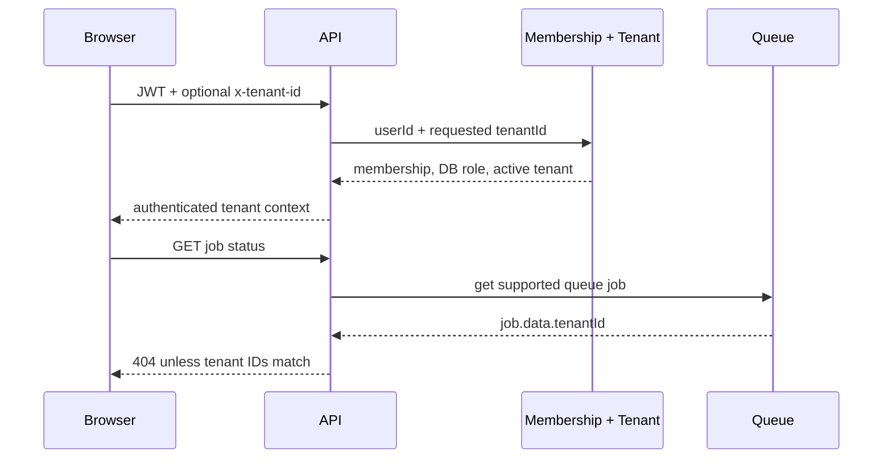

# Plan: Tenant Isolation Hardening

## Overview

Implement the first critical slice from the SaaS roadmap: a request may use tenant data only after an active membership lookup, a user may read only jobs owned by that tenant, and a browser must not reuse tenant A's SWR response while tenant B is selected.

## Scope and success criteria

- A tenant from either a JWT claim or `x-tenant-id` must resolve through the same database membership and tenant-state check. The database role overrides the token role.
- Suspended and cancelled tenants cannot establish tenant context. Pending tenants remain usable during the existing onboarding flow.
- `GET /jobs/status/:queueName/:jobId` is limited to supported queues, an authenticated tenant context, and jobs whose payload tenant ID matches the requester. Its access policy matches manual sync: owner or warehouse manager.
- Tenant-scoped SWR keys include the current tenant ID. Switching tenants displays no cached response from the prior tenant while the new key loads.
- New backend security paths have unit tests. Frontend gets a minimal Vitest unit test for cache-key construction.

## Design

## Phases

### Phase 1: Tests first

- Files: `backend/src/auth/jwt.strategy.spec.ts`, `backend/src/jobs/jobs.service.spec.ts`, `frontend/lib/tenant-cache.test.ts`.
- Cover suspended tenant, untrusted token role, missing membership, queue allowlist, cross-tenant job, and tenant-key separation.
- Success: tests execute and fail only because the intended behavior does not exist.

### Phase 2: Backend authorization

- Files: `backend/src/auth/jwt.strategy.ts`, `backend/src/jobs/jobs.controller.ts`, `backend/src/jobs/jobs.service.ts`, `backend/src/jobs/dto/job-data.interface.ts`.
- Use a single membership query path and DB role. Add tenant ID to stock-sync jobs. Validate queue names and return `404` for unknown or foreign jobs.
- Success: security tests pass; `npm run build` and `npm test` pass.

### Phase 3: Frontend cache boundary

- Files: `frontend/lib/tenant-cache.ts`, `frontend/hooks/useTenants.ts`, tenant-scoped data hooks, `frontend/package.json`.
- Subscribe to the existing `tenantChanged` event and use `[tenantId, resource]` SWR keys. Preserve existing endpoint URLs and mutations.
- Success: tenant key test passes; lint and build pass.

## Risks and rollback

- Pending tenants must remain accessible because creation currently starts onboarding in `PENDING`; only `SUSPENDED`, `CANCELLED`, and inactive tenants are blocked.
- Existing jobs without a tenant ID are intentionally unreadable after deployment. New jobs receive a required tenant ID.
- Cache key changes cause a one-time refetch after deploy. Rollback is code-only; no migration is required.
